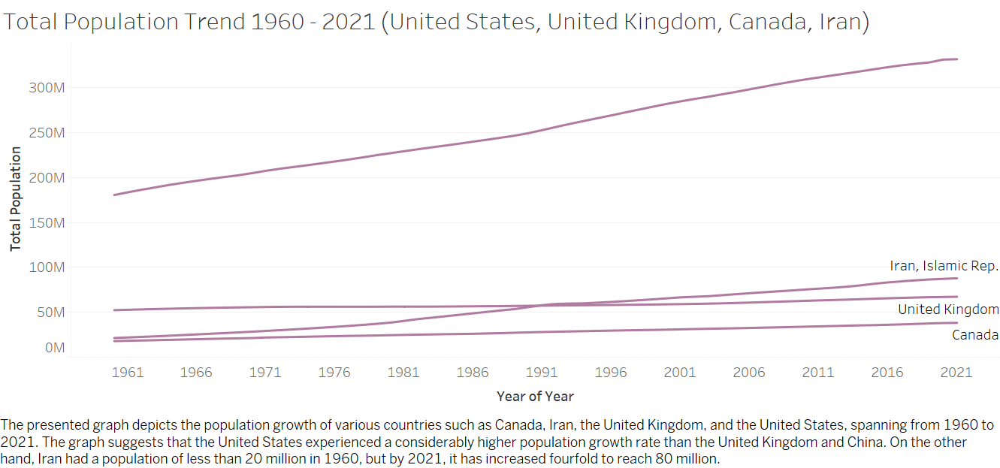
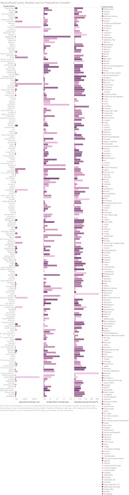

# Climate-Change-Analysis---Tableau

## Introduction
The issue of climate change is intricate and diverse, resulting from a range of elements such as human actions and natural occurrences. Analyzing climate data provides us with valuable information about the underlying mechanisms of climate change, which in turn helps to make informed policy decisions. Moreover, through examining climate data, we can forecast some ecological issues like the greenhouse effect. And the results would help officials to address global change.
We have gathered three distinct data files from the source, one of which is an API metric containing data points for various variables collected between 1960 and 2021, which was taken from Kaggle. The remaining two files describe the parameters for the metric found in the fourth column, and both files also include metadata, taken from the World Bank data. The climate change data set that we work on consists of 63 rows and 16950 columns including the country name, country code, region, indicator name, source note, source organization, and the years from 1960 to 2021. It should be mentioned that it includes almost all countries across the world. Also, much information like agricultural land, arable land, deforestation, electricity consumption, population, and various kinds of emissions, the most important of which is CO2 are included in the aforementioned columns.
The impact of greenhouse gases, particularly carbon dioxide (CO2), on the earth's climate has become an increasingly important issue in recent years. CO2 emissions are produced by a variety of human activities, including the burning of fossil fuels, deforestation, and industrial processes. Understanding how much CO2 each country is emitting is crucial in developing effective climate policies and mitigating the effects of climate change. Thus, we generate the plots to determine how the CO2 emission will affect the climate and how each country’s population affects that climate. In this project, we evaluate this emission than others.

## Analysis 
Humans and population are one of the reasons for increasing greenhouse gases. We want to assess its effect in some countries. But first we need to see how the population growth is in countries. Of all countries we select Canada, China, India, Iran, U.K and U.S.

As it can be seen, the rate of population growth in India and China is much higher than the other 4 countries. And these 2 counties take the same population of 1400M in the year 2016.

In countries with substantial agricultural land, there does not seem to be a consistent pattern of population growth. Some countries with large agricultural areas have moderate population growth rates, while others have higher rates. There is no clear indication that a higher percentage of arable land within agricultural land correlates with either an increase or decrease in population growth rates. Some countries with a high percentage of arable land show varying levels of population growth. 
