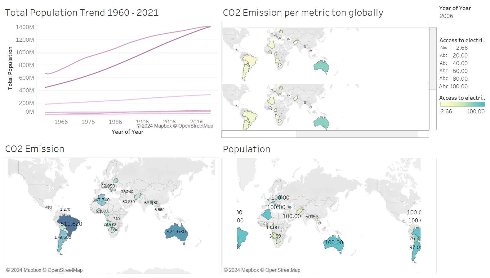

# Climate-Change-Analysis---Tableau

## Introduction
The issue of climate change is intricate and diverse, resulting from a range of elements such as human actions and natural occurrences. Analyzing climate data provides us with valuable information about the underlying mechanisms of climate change, which in turn helps to make informed policy decisions. Moreover, through examining climate data, we can forecast some ecological issues like the greenhouse effect. And the results would help officials to address global change.
We have gathered three distinct data files from the source, one of which is an API metric containing data points for various variables collected between 1960 and 2021, which was taken from Kaggle. The remaining two files describe the parameters for the metric found in the fourth column, and both files also include metadata, taken from the World Bank data. The climate change data set that we work on consists of 63 rows and 16950 columns including the country name, country code, region, indicator name, source note, source organization, and the years from 1960 to 2021. It should be mentioned that it includes almost all countries across the world. Also, much information like agricultural land, arable land, deforestation, electricity consumption, population, and various kinds of emissions, the most important of which is CO2 are included in the aforementioned columns.
The impact of greenhouse gases, particularly carbon dioxide (CO2), on the earth's climate has become an increasingly important issue in recent years. CO2 emissions are produced by a variety of human activities, including the burning of fossil fuels, deforestation, and industrial processes. Understanding how much CO2 each country is emitting is crucial in developing effective climate policies and mitigating the effects of climate change. Thus, we generate the plots to determine how the CO2 emission will affect the climate and how each country’s population affects that climate. In this project, we evaluate this emission than others.

## Analysis 
Humans and population are one of the reasons for increasing greenhouse gases. We want to assess its effect in some countries. But first we need to see how the population growth is in countries. Of all countries we select Canada, China, India, Iran, U.K and U.S.

As it can be seen, the rate of population growth in India and China is much higher than the other 4 countries. And these 2 counties take the same population of 1400M in the year 2016.

In countries with substantial agricultural land, there does not seem to be a consistent pattern of population growth. Some countries with large agricultural areas have moderate population growth rates, while others have higher rates. There is no clear indication that a higher percentage of arable land within agricultural land correlates with either an increase or decrease in population growth rates. Some countries with a high percentage of arable land show varying levels of population growth. However, the agricultural land, as depicted by the length of the bars in the chart, doesn't appear to decrease proportionally. This could suggest that both countries have managed to maintain their agricultural land through practices such as intensification of agriculture, improving crop yields with technology, or implementing policies to protect agricultural land from being repurposed for urban development. In a country like Russia, which has low population growth, you might see a decrease in agricultural land, which could be due to urban expansion or perhaps a shift in the economy away from agriculture. This indicates that factors other than population growth, such as economic policy and urban planning, can significantly affect the status of agricultural land. In countries like Nigeria, there may be a notable population growth alongside an increase in agricultural land. This could be due to the conversion of other types of land into agricultural use to meet the food demand of a growing population. However, this might raise concerns about sustainability and environmental impact, as expanding agricultural land can lead to deforestation and loss of biodiversity.

The dashboard provides a clear visual representation of four components depicting the trends and distribution of total population growth from 1960 to 2021, CO2 emissions per metric ton globally for the year 2006, and corresponding maps highlighting CO2 emissions and population for selected regions.

### 1-Total Population Trend 1960 - 2021
The line graph shows a consistent increase in total population over the years, suggesting exponential growth. The steeper the slope, the more rapid the population growth. For example, if we consider countries like India and China, which house over a third of the world's population, their dramatic population rise has put pressure on their resources, including land use, energy consumption, and contributes to CO2 emissions due to increased demand for industrialization and energy.

### 2-CO2 Emission per Metric Ton Globally (2006)
The choropleth map indicates the CO2 emissions per metric ton by country for the year 2006. Darker shades likely represent higher emissions. Countries like China, the United States, and parts of Europe appear darker, indicating higher emissions. For instance, the United States has historically been one of the largest emitters of CO2, largely due to its high energy consumption, reliance on fossil fuels, and industrial activities.

### 3-CO2 Emission Map
The numeric labels on the map indicate the actual CO2 emissions by country. Higher numbers suggest greater emissions. The United States and China stand out with very high numbers, such as 511,620 and 371,630 respectively, likely indicating thousands of metric tons emitted, which is in line with their industrial activities and population sizes.

### 4-Population Map
This map displays population numbers, with 100.00 possibly indicating a percentage or a specific population metric like millions. Regions like India, China, and other highly populated areas are shaded, indicating high population densities. For example, countries with a '100.00' label may have reached a certain population threshold that could be significant in the context of this analysis.

- **High Population & High Emissions**: Countries like China and India, with large populations, also show high CO2 emissions. This suggests a direct correlation between population size and emissions, likely due to greater energy consumption and industrial activities required to support the population.

- **High Population & Lower Emissions**: However, high population does not always equate to high emissions. Some countries with large populations may have lower emissions due to less industrial activity or more renewable energy usage. For example, countries in Africa may have large populations but lower industrialization levels, hence lower emissions.

- **Lower Population & High Emissions**: Conversely, some countries with smaller populations have high emissions, like the U.S. and Canada. This could be due to higher per capita energy consumption and greater reliance on fossil fuels.

- **Policy Implications**: Such data can inform policy decisions, where countries like the U.S. and China may focus on reducing emissions through technology and renewable energy, while India may also focus on population control measures alongside sustainability initiatives.

- **Sustainable Development**: It's essential for rapidly developing countries to implement sustainable practices to prevent further environmental degradation, as seen by the high emissions despite significant populations.

This analysis underscores the need for tailored climate and energy policies that consider both population dynamics and economic activities. It highlights the varying challenges countries face in balancing economic growth with environmental sustainability.
